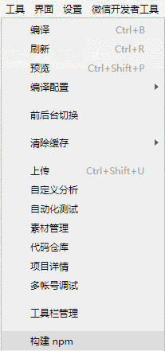

# Taro 按需引用文档

参考代码 `examples/taro-manual-load`

注意：小程序开发者工具打开的项目目录是打包后的 `dist` 目录

## 准备工作

1. 安装依赖

```bash
npm install echarts-for-weixin
```

2. 在项目根目录中新建文件 `project.package.json` 或者自定义命名，此文件是小程序的 `package.json`，并在下一步中添加小程序自定义构建 npm 方式。并配置 `config/index.js` 中的 `copy` 选项，将 `project.package.json` 复制到 `dist` 目录下并且重命名为 `package.json`。并且复制 `node_modules/echarts-for-weixin` 至 `dist/node_modules/echarts-for-weixin` 避免在小程序开发者工具中打开的项目重新安装依赖

`config/index.js`

```js
{
  copy: {
    patterns: [
      { from: 'project.package.json', to: 'dist/package.json' }, // 指定需要 copy 的文件
      { from: 'node_modules/echarts-for-weixin/', to: 'dist/node_modules/echarts-for-weixin/' }
    ],
    options: {}
  }
}
```

3. 在 `project.config` 的 `setting` 中添加小程序自定义构建 npm 方式，参考 [自定义 node_modules 和 miniprogram_npm 位置的构建 npm 方式](https://developers.weixin.qq.com/miniprogram/dev/devtools/npm.html#%E8%87%AA%E5%AE%9A%E4%B9%89-node-modules-%E5%92%8C-miniprogram-npm-%E4%BD%8D%E7%BD%AE%E7%9A%84%E6%9E%84%E5%BB%BA-npm-%E6%96%B9%E5%BC%8F)

```json
{
  "setting": {
    "packNpmManually": true,
    "packNpmRelationList": [
      {
        "packageJsonPath": "./package.json",
        "miniprogramNpmDistDir": "./"
      }
    ]
  }
}
```

4. 执行 `Taro` 的开发或者打包命令进行项目开发

```bash
npm run dev:weapp
```

5. 小程序开发者工具中构建 npm。注意：小程序开发工具打开的项目目录是 `dist` 文件夹

点击开发者工具中的菜单栏：工具 --> 构建 npm



## 引入 Echarts

1. 在全局的 `app.config.js` 中添加或者在单个需要使用到 `echarts` 的页面配置中添加引用组件

```json
{
  "usingComponents": {
    "ec-canvas": "echarts-for-weixin"
  }
}
````

2. 在页面中引入 `echarts/core` 和需要的组件，Taro 打包会只打包引入的组件，这样达到按需引入的目的

```js
// Import the echarts core module, which provides the necessary interfaces for using echarts.
import * as echarts from 'echarts/core';
// Import charts, all with Chart suffix
import {
  // LineChart,
  BarChart,
  // PieChart,
  // ScatterChart,
  // RadarChart,
  // MapChart,
  // TreeChart,
  // TreemapChart,
  // GraphChart,
  // GaugeChart,
  // FunnelChart,
  // ParallelChart,
  // SankeyChart,
  // BoxplotChart,
  // CandlestickChart,
  // EffectScatterChart,
  // LinesChart,
  // HeatmapChart,
  // PictorialBarChart,
  // ThemeRiverChart,
  // SunburstChart,
  // CustomChart,
} from 'echarts/charts';
// import components, all suffixed with Component
import {
  // GridSimpleComponent,
  GridComponent,
  // PolarComponent,
  // RadarComponent,
  // GeoComponent,
  // SingleAxisComponent,
  // ParallelComponent,
  // CalendarComponent,
  // GraphicComponent,
  // ToolboxComponent,
  TooltipComponent,
  // AxisPointerComponent,
  // BrushComponent,
  TitleComponent,
  // TimelineComponent,
  // MarkPointComponent,
  // MarkLineComponent,
  // MarkAreaComponent,
  // LegendComponent,
  // LegendScrollComponent,
  // LegendPlainComponent,
  // DataZoomComponent,
  // DataZoomInsideComponent,
  // DataZoomSliderComponent,
  // VisualMapComponent,
  // VisualMapContinuousComponent,
  // VisualMapPiecewiseComponent,
  // AriaComponent,
  // TransformComponent,
  DatasetComponent,
} from 'echarts/components';
// Import renderer, note that introducing the CanvasRenderer or SVGRenderer is a required step
import {
  CanvasRenderer,
  // SVGRenderer,
} from 'echarts/renderers';
// Register the required components
echarts.use(
  [
    TitleComponent,
    TooltipComponent, 
    GridComponent, 
    BarChart, 
    CanvasRenderer, 
    HeatmapChart, 
    VisualMapComponent,
    VisualMapContinuousComponent,
    VisualMapPiecewiseComponent,
  ]
);
```

3. 将引入的 `echarts` 传给组件

```js
<ec-canvas 
  id='mychart-dom-area' 
  canvas-id='mychart-area' 
  echarts={echarts} // 将引入的 echarts 传给组件
  ec={this.state.ec}
/>
```

4. `ec-canvas` 的具体用法和如何初始化图表请参考 [Echarts 官方小程序示例](https://github.com/ecomfe/echarts-for-weixin#%E5%88%9B%E5%BB%BA%E5%9B%BE%E8%A1%A8)

示例代码

```js
function initChart(canvas, width, height) {
  const chart = echarts.init(canvas, null, {
    width: width,
    height: height
  })
  canvas.setChart(chart)
  const model = {
    yCates: ['Saturday', 'Friday', 'Thursday',
      'Wednesday', 'Tuesday', 'Monday',
      'Sunday'],
    xCates: ['1', '2', '3', '4', '5'],
    data: [
      // [yCateIndex, xCateIndex, value]
      [0, 0, 5], [0, 1, 7], [0, 2, 3], [0, 3, 5], [0, 4, 2],
      [1, 0, 1], [1, 1, 2], [1, 2, 4], [1, 3, 8], [1, 4, 2],
      [2, 0, 2], [2, 1, 3], [2, 2, 8], [2, 3, 6], [2, 4, 7],
      [3, 0, 3], [3, 1, 7], [3, 2, 5], [3, 3, 1], [3, 4, 6],
      [4, 0, 3], [4, 1, 2], [4, 2, 7], [4, 3, 8], [4, 4, 9],
      [5, 0, 2], [5, 1, 2], [5, 2, 3], [5, 3, 4], [5, 4, 7],
      [6, 0, 6], [6, 1, 5], [6, 2, 3], [6, 3, 1], [6, 4, 2]
    ]
  }

  const data = model.data.map(function (item) {
    return [item[1], item[0], item[2] || '-']
  })

  const option = {
    tooltip: {
      position: 'top'
    },
    animation: false,
    grid: {
      bottom: 60,
      top: 10,
      left: 80
    },
    xAxis: {
      type: 'category',
      data: model.xCates
    },
    yAxis: {
      type: 'category',
      data: model.yCates
    },
    visualMap: {
      min: 1,
      max: 10,
      show: false,
      calculable: true,
      orient: 'horizontal',
      left: 'center',
      bottom: 10,
      inRange: {
        color: ['#37A2DA', '#32C5E9', '#67E0E3', '#91F2DE', '#FFDB5C', '#FF9F7F'],
      }
    },
    series: [{
      name: 'Punch Card',
      type: 'heatmap',
      data: data,
      label: {
        normal: {
          show: true
        }
      },
      itemStyle: {
        emphasis: {
          shadowBlur: 10,
          shadowColor: 'rgba(0, 0, 0, 0.5)'
        }
      }
    }]
  }

  chart.setOption(option)
  return chart
}

export default class Echarts extends React.Component {

  state = {
    ec: {
      onInit: initChart
    }
  }

  render () {
    return (
      <View className='echarts'>
        <ec-canvas 
          id='mychart-dom-area' 
          canvas-id='mychart-area' 
          echarts={echarts} 
          ec={this.state.ec}
        />
      </View>
    )
  }
}
```

5. 可以查看小程序开发者工具中的依赖分析，确定文件大小以及是否正确按需引入


## 参考链接

- [按需引入 ECharts 图表和组件](https://echarts.apache.org/zh/tutorial.html#%E5%9C%A8%E6%89%93%E5%8C%85%E7%8E%AF%E5%A2%83%E4%B8%AD%E4%BD%BF%E7%94%A8%20ECharts)
- [Echarts 在线定制](https://echarts.apache.org/zh/builder.html)
- [echarts-for-react](https://github.com/hustcc/echarts-for-react)